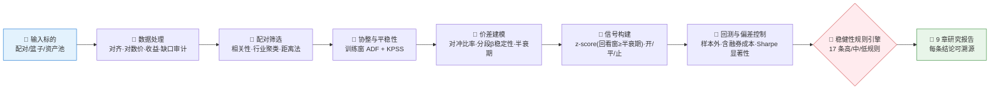
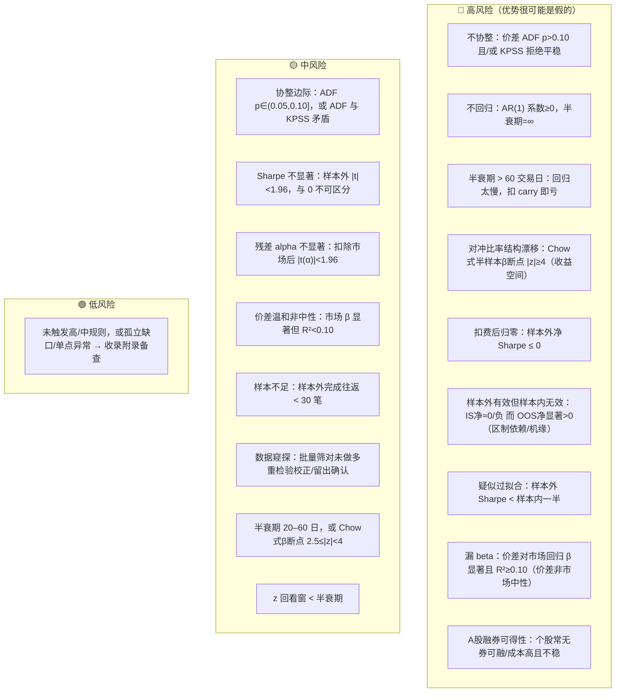

# 📈 Statistical Arbitrage & Time Series Skill

**简体中文** | [English](README.en.md)

> 输入一组候选标的（配对、篮子或资产池），输出一份可复现、可溯源的统计套利研究报告：数据处理、配对筛选、**训练窗**协整与平稳性检验、价差均值回归与对冲比率稳定性、信号构建、含**融券成本**与 **Sharpe 显著性**的带偏差控制回测 —— 一次验真伪。

<p align="center">
  
  
  
  
  
  
</p>

---

## 📖 这是什么

`statistical-arbitrage-time-series` 是一个 **Agent Skill**：对一组候选标的（如配对 `["600519.SH","000858.SZ"]`）做一键统计套利研究。它把价差套利的完整研究链按 **7 个分析阶段**串成流水线，叠加 **17 条分级稳健性规则**，最终产出 9 章结构化报告 —— 每个结论都标注数据窗口、样本量、所用检验或公式。

它最核心的能力是**判断"表观优势"是真是假**：漂亮的样本外净值曲线一文不值，除非它① Sharpe 的 t 统计量足够大（与 0 可区分）、② 没有前视泄漏、③ 扛得过含融券 carry 的真实成本、④ 不是把方向性 beta 当成 alpha。本技能默认抱持怀疑，主动设计实验去**证伪**而非印证；当证据只是"指示性"时，明说"需继续证伪"，不下可交易结论。

> 原始行情数据由内置脚本 [`scripts/run_statarb.py`](../scripts/run_statarb.py) 的 `load_prices()` 直接拉取（A股用 `akshare`，美股用 `yfinance`），本技能自洽可装、无外部技能依赖。统计计算优先用 `statsmodels`；无网/无库时脚本退化为 numpy 近似仅供自测，真实研究请装 `statsmodels` 取精确 p 值。

---

## ⚡ 研究流水线



---

## 🗂️ 七个分析阶段 × 方法映射

| 阶段 | 方法/检验 | 回答什么 |
|---|---|---|
| 🧹 **数据处理** | 行情加载（akshare·yfinance）· 交易日对齐 · 对数价 · 收益序列 · 缺口/异常审计 | 序列干净、对齐、同币种吗？对齐后可用样本多少？ |
| 🔎 **配对筛选** | 相关性筛选 · 行业/聚类过滤 · 距离法(SSD) · 初步协整扫描 | 哪些标的经济上相关、值得正式检验？筛了多少对（多重检验暴露）？ |
| 🧪 **协整与平稳性** | **训练窗** `adfuller` + `kpss`（对偶零假设）· Engle-Granger/Johansen（Agent 补充） | 真的存在可交易平稳价差吗？相关 ≠ 协整。检验只用训练窗，防前视。 |
| 📐 **价差建模** | OLS 对冲比率（仅训练窗）· **分段/滚动 β 稳定性** · AR(1) 半衰期 | 价差怎么构造？对冲比率稳吗（会漂移吗）？回归多快？ |
| 🎯 **信号构建** | 价差滚动均值/标准差 · z-score（回看窗 **≥ 半衰期**）· 开/平/止损带 · 持仓上限 | 何时开/平/止？窗别比半衰期还短（否则制造伪信号）。 |
| 🔁 **回测与偏差控制** | 向量化回测 · 样本内外隔离 · **成本=佣金(双腿)+卖出印花税+融券carry** · **因子归因（策略α/β + 价差市场中性）** · Chow/CUSUM/walk-forward（Agent 补充） | 样本外还成立吗？扣费后还剩多少？优势是不是漏进来的方向性 beta？ |
| 📊 **绩效与风险** | 年化收益 · **Sharpe + t 统计量** · Sortino · 最大回撤 · Calmar · 完成往返 · 换手 | 收益与下行风险画像如何？Sharpe 与 0 可区分吗？ |

---

## 🚨 稳健性规则引擎

默认规则一览（可由用户阈值覆盖，缺输入时自动降级为定性提示）：



组合信号会被显式命名，例如 `协整边际 + Sharpe不显著`、`半衰期过长 + 扣费后归零`、`样本外有效但样本内无效 + 样本量不足`。完整规则文本与触发口径见 [`references/statarb-guide.md`](../references/statarb-guide.md)。

> **诚实边界**：脚本实现的是 OLS β、ADF+KPSS（训练窗判定 + 全样本/OOS 对照）、**收益空间对冲比率稳定性（Chow式半样本β断点+噪声校正离散度）**、半衰期、自适应 z 回测（含成本）、Sharpe t 检验（含重叠折减）、**两级因子归因（策略收益 α/β + 价差市场中性）** 与上述规则。**Johansen、Kalman 动态对冲、完整 Chow/CUSUM 套件、真正的 walk-forward** 属于 Agent 在 guide 指引下补充的进阶项，未做则在报告里写"未做"，不得伪称已自动完成。

---

## 🚀 快速开始

### 1️⃣ 安装

```bash
# 安装运行依赖（A股用 akshare；美股把 akshare 换成 yfinance）
pip install statsmodels akshare pandas numpy scipy

# Claude Code（全局）
cp -r skill-statistical-arbitrage-time-series   ~/.claude/skills/statistical-arbitrage-time-series

# Codex（全局，推荐开放 Agent Skills 标准目录）
mkdir -p ~/.agents/skills
cp -r skill-statistical-arbitrage-time-series   ~/.agents/skills/statistical-arbitrage-time-series

# Cursor（项目级）
mkdir -p .cursor/skills
cp -r skill-statistical-arbitrage-time-series   .cursor/skills/statistical-arbitrage-time-series
```

> 也可不经 Agent 直接跑脚本验证（含离线自测，无需联网）：
> ```bash
> python scripts/run_statarb.py --a 600519.SH --b 000858.SZ --source akshare --start 2020-01-01
> # 五种分支自测（合成数据，覆盖每条裁决路径）：
> python scripts/run_statarb.py --source synthetic --mode strong      # 🟢 绿灯：可进一步研究
> python scripts/run_statarb.py --source synthetic --mode coint       # 🟡 协整但证据不足（慢回归）
> python scripts/run_statarb.py --source synthetic --mode nocoint     # 🔴 不协整
> python scripts/run_statarb.py --source synthetic --mode inversion   # 🔴 样本外有效但样本内无效
> python scripts/run_statarb.py --source synthetic --mode leaked      # 🟡 价差非市场中性（漏 beta）
> python scripts/run_statarb.py --source synthetic --mode drift       # 🔴 对冲比率结构漂移（Chow式断点）
> # 自定义成本：--commission-bps 5 --stamp-duty-bps 5 --borrow-annual-bps 800
> ```

### 2️⃣ 直接用自然语言提问

```text
帮我对 600519.SH 和 000858.SZ 做一份配对交易研究，重点看协整、扣费后的 Sharpe 及其显著性
这条价差还能交易吗？测一下半衰期、对冲比率是否稳定、考虑融券成本后还剩多少 Sharpe
从这 20 只银行股里筛出协整最强的配对，并提醒我数据窥探与 A 股做空可得性风险
```

### 3️⃣ 报告结构（固定 9 章）

```
摘要与结论 → 数据与标的池 → 配对筛选 → 协整与平稳性检验 → 价差建模与均值回归
→ 信号构建 → 回测与偏差控制 → 稳健性与风险信号清单 → 方法附录
```

风险信号清单为表格：`风险等级 | 信号 | 触发规则 | 证据 | 窗口/样本 | 所用检验或公式`。
方法附录为表格：`分析阶段 | 数据来源/方法 | 查询或样本窗口 | 可用样本量 | 关键统计量/参数 | 备注`（含"未做项"清单）。

---

## 📦 目录结构

```
Statistical Arbitrage & Time Series Modeling/
├── SKILL.md                       # 技能入口：工作流、分析规则、质量门槛
├── references/
│   └── statarb-guide.md           # 📒 阶段方法地图、衍生指标公式、稳健性规则、实现/补充边界、报告蓝图、QA清单
├── scripts/
│   └── run_statarb.py             # 🐍 可执行骨架：取数→训练窗协整→半衰期/β稳定性→自适应信号→含成本回测→Sharpe显著性→规则→报告
└── agents/
    └── README.md                  # 📖 本说明文件
```

---

## 📐 核心约束

| 约束 | 说明 |
|---|---|
| 🧾 取数自洽 | 行情由内置 `run_statarb.py`（akshare/yfinance）拉取，不发明接口；统计计算用 statsmodels/numpy/pandas |
| 🧮 公式透明 | 对冲比率、ADF/KPSS、半衰期、z-score、Sharpe **及其 t 统计量**、扣费收益等衍生指标须写出公式与序列名 |
| 🧪 协整必检（训练窗） | 相关 ≠ 协整；ADF+KPSS 仅在训练窗价差上做标题判定，全样本/样本外仅作对照，绝不默认成立 |
| 🚪 样本外隔离 | 对冲比率与所有阈值仅在训练窗估计，留出最近约 30% 作样本外；同时检查"样本内外倒挂"与过拟合两种失败模式 |
| 💸 成本即证据 | 佣金（双腿）+ 卖出印花税 + 滑点 + **做空腿融券 carry** 须建模；同时给毛/净两套绩效 |
| 📏 显著性必报 | Sharpe 必须给 t 统计量；|t|<2 标注"与 0 不可区分"，不当作 edge |
| 🩻 防漏 beta | 对冲比率低、两腿同向时价差可能混入方向性 beta：脚本自动做价差对市场回归（市场中性检验）+ 策略收益 α/β 归因 |
| 🕳️ 空数据如实报 | 无数据或样本不足的章节保留标题并写明"方法 + 窗口 + 缺什么"，不静默跳过 |
| 🔬 窥探须披露 | 批量筛对时说明筛了多少对、是否做多重检验校正或留出确认 |
| 🧭 边界诚实 | 脚本未实现的 Johansen/Kalman/Chow/CUSUM/walk-forward，未做则写"未做"，不伪称自动完成 |
| 🗣️ 措辞克制 | 用"可能存在均值回归""需要样本外确认""Sharpe 与 0 不可区分""扣费后优势消失"，不下涨跌结论，不用买卖语言 |

---

## ⚠️ 免责声明

本报告基于公开数据与规则化分析生成，仅供研究参考，不构成任何投资建议。

## 📜 License

This project is licensed under the GNU General Public License v3.0. See [LICENSE](LICENSE).
