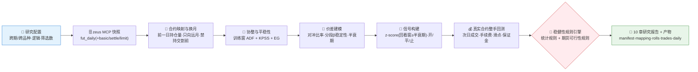
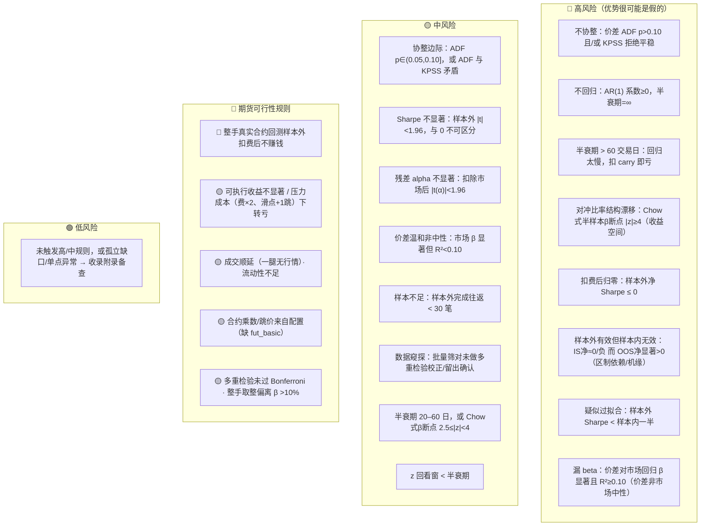

# 📈 Statistical Arbitrage & Time Series Skill

**简体中文** | [English](README.en.md)

> 面向国内商品期货：输入一对**跨期**（如螺纹主力 vs 次主力）或**跨品种**（如热卷 vs 螺纹，需写明产业链逻辑）价差，经 **zeus MCP** 取日线，输出可复现、可溯源的研究报告：按时点安全的合约映射与换月、**训练窗**协整与平稳性检验、价差均值回归与对冲比率稳定性、**真实合约整手回测**（逐腿手续费·滑点·保证金·涨跌停·流动性）与 Sharpe 显著性 —— 统计证据与交易可行性分开判定。

<p align="center">
  
  
  
  
  
  
</p>

---

## 📖 这是什么

`statistical-arbitrage-time-series` 是一个 **Agent Skill**：对一对商品期货价差（跨期或跨品种）做一键统计套利研究。它把研究链串成流水线：zeus 取数 → 合约映射与换月 → 研究用连续序列上的统计检验 → 真实合约整手回测 → 期货风险规则 → 10 章报告，每个结论都标注数据窗口、样本量、所用检验或公式，并附 run_id 与快照哈希以便离线复跑。

它最核心的能力是**判断"表观优势"是真是假**：漂亮的样本外净值曲线一文不值，除非它① Sharpe 的 t 统计量足够大（与 0 可区分）、② 没有前视泄漏、③ 扛得过逐腿手续费与滑点的真实成本、④ 不是把方向性 beta 当成 alpha。本技能默认抱持怀疑，主动设计实验去**证伪**而非印证；当证据只是"指示性"时，明说"需继续证伪"，不下可交易结论。

> 行情数据只来自 **zeus MCP**（期货日线 `fut_daily` 与合约信息 `fut_basic`，接口见 [`references/zeus-mcp-interface.md`](../references/zeus-mcp-interface.md)）：内置脚本用 `--fetch` 调 MCP，把响应原样存成不可变快照，再离线回放；不接第三方数据源、不直连数据库。手续费率与保证金率由用户在配置中按品种指定；涨跌停暂不建模。统计检验一律用 `statsmodels`（必需依赖，缺失时脚本直接报错，不做近似），保证 p 值真实。

---

## ⚡ 研究流水线



---

## 🗂️ 七个分析阶段 × 方法映射

| 阶段 | 方法/检验 | 回答什么 |
|---|---|---|
| 🗄️ **数据与映射** | zeus MCP 快照 · 主力/次主力按前一日持仓量映射（按时点安全）· 换月事件 · 研究用连续序列（无拼接跳空） | 每天用哪张合约？何时换月、依据是什么？研究序列与可执行价格分开了吗？ |
| 🔎 **候选与逻辑** | 跨期：期限结构/持有成本；跨品种：必须写明产业链逻辑 · 记录筛选数量与方法 · Bonferroni 阈值 | 为什么是这一对？筛了多少对（多重检验暴露）？ |
| 🧪 **协整与平稳性** | **训练窗** `adfuller` + `kpss`（对偶零假设）· 训练窗 Engle-Granger（statsmodels）· Johansen（Agent 补充） | 真的存在可交易平稳价差吗？相关 ≠ 协整。检验只用训练窗，防前视。 |
| 📐 **价差建模** | OLS 对冲比率（仅训练窗）· **分段/滚动 β 稳定性** · AR(1) 半衰期 | 价差怎么构造？对冲比率稳吗（会漂移吗）？回归多快？ |
| 🎯 **信号构建** | 价差滚动均值/标准差 · z-score（回看窗 **≥ 半衰期**）· 开/平/止损带 · 持仓上限 | 何时开/平/止？窗别比半衰期还短（否则制造伪信号）。 |
| 🔁 **回测与偏差控制** | 研究口径：价差对数收益 · 样本内外隔离 · 近似成本 ｜ **交易可行性：真实合约·整手·次日成交·逐腿手续费/滑点·用户指定保证金率·一腿无行情则两腿都不成交·流动性标记·压力情景** | 样本外还成立吗？换成真实合约和整手、扣费后还剩多少？保证金收益率多少？ |
| 📊 **绩效与风险** | 年化收益 · **Sharpe + t 统计量** · Sortino · 最大回撤 · Calmar · 完成往返 · 换手 | 收益与下行风险画像如何？Sharpe 与 0 可区分吗？ |

---

## 🚨 稳健性规则引擎

默认规则一览（可由用户阈值覆盖，缺输入时自动降级为定性提示）：



组合信号会被显式命名，例如 `协整边际 + Sharpe不显著`、`半衰期过长 + 扣费后归零`、`样本外有效但样本内无效 + 样本量不足`。完整规则文本与触发口径见 [`references/statarb-guide.md`](../references/statarb-guide.md)。

> **诚实边界**：脚本实现的是 OLS β、ADF+KPSS（训练窗判定 + 全样本/OOS 对照）、**收益空间对冲比率稳定性（Chow式半样本β断点+噪声校正离散度）**、半衰期、自适应 z 回测（含成本）、Sharpe t 检验（含重叠折减）、**两级因子归因（策略收益 α/β + 价差市场中性）** 、按时点安全的合约映射/换月、训练窗 EG 协整、真实合约整手回测与上述规则。**Johansen、Kalman 动态对冲、完整 Chow/CUSUM 套件、真正的 walk-forward、季节性/区制分析** 属于 Agent 在 guide 指引下补充的进阶项，未做则在报告里写"未做"，不得伪称已自动完成。

---

## 🚀 快速开始

### 1️⃣ 安装

```bash
# 安装运行依赖（Python ≥ 3.10；statsmodels 为必需，缺失时脚本拒绝运行，保证 p 值真实）
pip install -r requirements.txt

# Claude Code（全局）
cp -r skill-statistical-arbitrage-time-series   ~/.claude/skills/statistical-arbitrage-time-series

# Codex（全局，推荐开放 Agent Skills 标准目录）
mkdir -p ~/.agents/skills
cp -r skill-statistical-arbitrage-time-series   ~/.agents/skills/statistical-arbitrage-time-series

# Cursor（项目级）
mkdir -p .cursor/skills
cp -r skill-statistical-arbitrage-time-series   .cursor/skills/statistical-arbitrage-time-series
```

> 也可不经 Agent 直接跑脚本（配置格式见 SKILL.md；zeus 接口见 references/zeus-mcp-interface.md）：
> ```bash
> export ZEUS_MCP_URL=http://<host>:8000/mcp ZEUS_MCP_TOKEN=<token>
> python scripts/run_statarb.py --check-zeus RB2501.SHF                            # 检查 zeus 工具与字段
> python scripts/run_statarb.py --config run1/config.json --fetch --out-dir run1   # zeus 取数 + 回放
> python scripts/run_statarb.py --config run1/config.json --out-dir run1b          # 离线复跑同一快照
> python -m pytest tests -q                                                        # 确定性测试（本地假 zeus）
> # 五种分支自测（合成数据，覆盖每条裁决路径）：
> python scripts/run_statarb.py --source synthetic --mode strong      # 🟢 绿灯：可进一步研究
> python scripts/run_statarb.py --source synthetic --mode coint       # 🟡 协整但证据不足（慢回归）
> python scripts/run_statarb.py --source synthetic --mode nocoint     # 🔴 不协整
> python scripts/run_statarb.py --source synthetic --mode inversion   # 🔴 样本外有效但样本内无效
> python scripts/run_statarb.py --source synthetic --mode leaked      # 🟡 价差非市场中性（漏 beta）
> python scripts/run_statarb.py --source synthetic --mode drift       # 🔴 对冲比率结构漂移（Chow式断点）
> # 自测成本：--fee-bps 1 --slippage-ticks 1（真实研究的合约参数来自 zeus，缺失时用 config 的 assumptions）
> ```

### 2️⃣ 直接用自然语言提问

```text
帮我分析螺纹主力和次主力（RB 跨期）的套利机会，重点看协整、换月、扣费后的 Sharpe 及其显著性
这条价差还能交易吗？测一下半衰期、对冲比率是否稳定、扣掉手续费和滑点后还剩多少 Sharpe、保证金收益率多少
螺纹钢和热卷（RB2501.SHF / HC2501.SHF）能做跨品种套利吗？提醒我数据窥探风险
```

### 3️⃣ 报告结构（10 章 + 可审计产物）

```
摘要与结论 → 数据、合约映射与换月 → 候选与经济逻辑 → 协整与平稳性检验 → 价差建模与均值回归
→ 交易可行性（真实合约·整手） → 回测与偏差控制（研究口径） → 稳健性与风险信号清单 → 方法附录
→ 未做的分析、数据限制与假设
```

产物：`report.md`、`manifest.json`（run_id、哈希、MCP 调用、能力缺口、参数来源、拟合参数、指标）、`mapping.csv`、`rolls.csv`、`trades.csv`、`daily.csv`、`events.csv`。

风险信号清单为表格：`风险等级 | 信号 | 触发规则 | 证据 | 窗口/样本 | 所用检验或公式`。
方法附录为表格：`分析阶段 | 数据来源/方法 | 查询或样本窗口 | 可用样本量 | 关键统计量/参数 | 备注`（含"未做项"清单）。

---

## 📦 目录结构

```
Statistical Arbitrage & Time Series Modeling/
├── SKILL.md                       # 技能入口：工作流、分析规则、质量门槛
├── requirements.txt               # numpy/pandas/scipy/statsmodels（必需）
├── references/
│   ├── statarb-guide.md           # 📒 阶段方法地图、衍生指标公式、稳健性规则、实现/补充边界、报告蓝图、QA清单
│   └── zeus-mcp-interface.md      # 🔌 zeus MCP 工具约定（fut_daily、fut_basic）
├── scripts/
│   ├── run_statarb.py             # 🐍 编排：配置校验→zeus 取数/快照→回放→统计证据→规则→报告与产物
│   └── futures.py                 # 🧾 期货规则：合约映射/换月、研究序列、合约参数、整手可执行回测
├── tests/                         # 🧪 确定性测试（本地假 zeus + 合约级数据生成器）
└── agents/
    └── README.md                  # 📖 本说明文件
```

---

## 📐 核心约束

| 约束 | 说明 |
|---|---|
| 🧾 取数自洽 | 行情与合约参数只经 zeus MCP 取得并存为不可变快照（run_id + sha256），可离线复跑；zeus 缺的工具记为能力缺口并披露替代办法，缺值不默认为 0 |
| 🧮 公式透明 | 对冲比率、ADF/KPSS、半衰期、z-score、Sharpe **及其 t 统计量**、扣费收益等衍生指标须写出公式与序列名 |
| 🧪 协整必检（训练窗） | 相关 ≠ 协整；ADF+KPSS 仅在训练窗价差上做标题判定，全样本/样本外仅作对照，绝不默认成立 |
| 🚪 样本外隔离 | 对冲比率与所有阈值仅在训练窗估计，留出最近约 30% 作样本外；同时检查"样本内外倒挂"与过拟合两种失败模式 |
| 💸 成本即证据 | 真实合约、整手、次日成交；逐腿手续费（费率/每手，开平各计）+ 滑点（跳）+ 用户指定的保证金率；一腿无行情则两腿都不成交；涨跌停暂不建模；给毛/净、压力情景与保证金收益率 |
| 📏 显著性必报 | Sharpe 必须给 t 统计量；|t|<2 标注"与 0 不可区分"，不当作 edge |
| 🩻 防漏 beta | 对冲比率低、两腿同向时价差可能混入方向性 beta：脚本自动做价差对市场回归（市场中性检验）+ 策略收益 α/β 归因 |
| 🕳️ 空数据如实报 | 无数据或样本不足的章节保留标题并写明"方法 + 窗口 + 缺什么"，不静默跳过 |
| 🔬 窥探须披露 | 批量筛对时说明筛了多少对、是否做多重检验校正或留出确认 |
| 🧭 边界诚实 | 统计证据 ≠ 交易可行性，分开判定；脚本未实现的 Johansen/Kalman/Chow/CUSUM/walk-forward/季节性，未做则写"未做"，不伪称自动完成 |
| 🗣️ 措辞克制 | 用"可能存在均值回归""需要样本外确认""Sharpe 与 0 不可区分""扣费后优势消失"，不下涨跌结论，不用买卖语言 |

---

## ⚠️ 免责声明

本报告基于公开数据与规则化分析生成，仅供研究参考，不构成任何投资建议。

## 📜 License

This project is licensed under the GNU General Public License v3.0. See [LICENSE](LICENSE).
